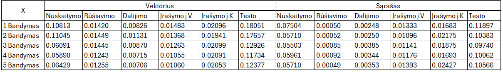
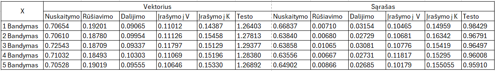
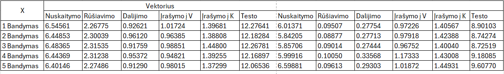
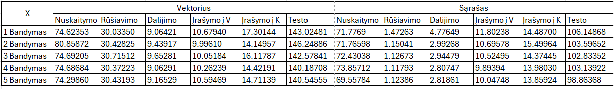
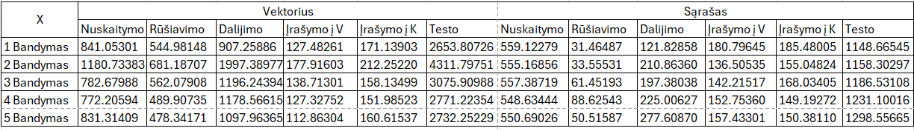

#Studentų galutinio balo apskaičiavimo programa. (v0.3 versija)

#Ši programa skirta apskaičiuoti galutiniams balams, įvedant arba nuskaitant iš failo studento vardą, pavardę, namų darbų rezultatus bei egzamino balą.

#Galutinis balas skaičiuojamas tokia formule: **Galutinis = 0.4 * vidurkis + 0.6 * egzaminas** (Kai reikia galutinio balo medianos pavidalu tai tiesiog vietoj vidurkio įstatoma mediana)

#Norint naudotis programa, reikia atlikti šiuos veiksmus:
- Pasirinkti, ar norite sugeneruoti failus(taip/ne).

Jei pasirinksite, kad norite sugeneruoti, tuomet failai bus sukurti ir išvedime bus rodomas failų kūrimo laikas.
  
- Atsakyti programai, ar norite įvesti studentų duomenis ar nuskaityti juos iš failo(ivesti/nuskaityti).
- Pasirinkti norimo naudoti konteinerio tipą (1 - vector, 2 - list).
- Pasirinkti rūšiavimo kritetijų (1 - pagal vardą, 2 - pagal pavardę, 3 - pagal galutinį balą).
  
Jei pasirenkate nuskaityti, tai programa tiesiogiai nuskaitys failą, naudodama pasirinktą konteinerio tipą, surušiuos studentus pagal galutinį balą(pagal vidurkį) į dvi grupes:Vargšiukai(galutinis balas < 5) ir Kietiakiai(galutinis balas >= 5), surušiuos pagal pasirinktą kriterijų ir išves į du naujus failus. 
  
  **Jei pasirenkate įvesti, tuomet toliau reikes atlikti šiuos veiksmus:**
- Įvesti studentų skaičių.
- Pasirinkti norimą naudoti konteinerį.
- Įvesti studento vardą ir pavardę.
- Pasirinkti ar namų darbų ir egzamino rezultatus reikia generuoti atsitiktinai(taip/ne).
- Atsakyti programai, ar žinai koks yra namų darbų skaičius(taip/ne).
- Įvesti namų darbų skaičių.
- Įvesti namų darbų visus rezultatus(10-balėje sistemoje).
- Galiausiai įvesti egzamino balą.
Išvedime prie studento duomenų matysite ir objekto saugojimo atmintyje adresą.

**#Sistemos parametrai**
1. Procesorius(CPU):
- Modelis: AMD Ryzen 5 3500U
- Dažnis: 2.10 GHz
- Branduoliai: 4
- Gijos: šiuo metu sistemoje yra apie 3700 gijų,taciau skaičius gali kisti. 
- Cache atmintis: L1(384 KB), L2(2.0 MB), L3(4.0 MB)

2. Operatyvioji atmintis(RAM):
- Talpa: 8 GB
- Dažnis: 2400 MHz
- Naudojami lizdai: 2 iš 2

3. Kietasis diskas(HDD/SSD):
- Tipas: SSD
- Talpa: 239 GB

**#Konteinerių testavimas**

Tiriama ar skiriasi ir kaip skiriasi programos sparta naudojant konteinerius std::vector ir std::list.

Buvo atlikta po 5 bandymus su kiekvieno dydžio failu. Matavimas sekundėmis. (Pastaba: V - Vargsiukai, K - Kietiakiai (failai))

1000 įrašų failo laikai

Gauti rezultatai suvidurkinami ir suapvalinami, kad būtū galima pamatyti aiškesnį skirtumą.

| Failo dydis(įrašai)         | Nuskaitymas (vec) | Nuskaitymas (list) | Rūšiavimas (vec) | Rūšiavimas (list) | Dalijimas (vec) | Dalijimas (list) | Įrašymas į V (vec) | Įrašymas į V (list) | Įrašymas į K (vec) | Įrašymas į K (list) | Testo (vec) | Testo (list) |
|--------------------|--------------------|---------------------|-------------------|--------------------|------------------|--------------------|--------------------|---------------------|--------------------|---------------------|--------------|--------------|
| 1000         | 0.081              | 0.061            | 0.014          | 0.001             | 0.008           | 0.003             | 0.012              | 0.012              | 0.021              | 0.020             | 0.145       | 0.105     |

Rezultatas: Lyginant suvidurkintus rezultatus, matome, kad nuskaitymo, rūšiavimo ir dalijimo laikai yra gana panašūs, tačiau naudojant  std::list konteinerį programa veikia šiek tiek greičiau. Įrašymo į failus vargšiukai ir kietiakiai laikai visiškai sutampa, kas rodo, kad įrašymo laikas nepriklauso nuo pasirenkamo konteinerio tipo. Galiausiai pastebima, kad viso testo laikas yra trumpesnis, kai naudojamas sąrašo tipo konteineris.

10000 įrašų failo laikai

Gauti rezultatai suvidurkinami ir suapvalinami, kad būtū galima pamatyti aiškesnį skirtumą.

| Failo dydis(įrašai)         | Nuskaitymas (vec) | Nuskaitymas (list) | Rūšiavimas (vec) | Rūšiavimas (list) | Dalijimas (vec) | Dalijimas (list) | Įrašymas į V (vec) | Įrašymas į V (list) | Įrašymas į K (vec) | Įrašymas į K (list) | Testo (vec) | Testo (list) |
|--------------------|--------------------|---------------------|-------------------|--------------------|------------------|--------------------|--------------------|---------------------|--------------------|---------------------|--------------|--------------|
| 10000         | 0.71              | 0.65            | 0.19          | 0.03             | 0.10          | 0.03            | 0.11             | 0.11            | 0.15              | 0.15            | 1.28      | 0.97    |

Rezultatas:Lyginant suvidurkintus rezultatus, matome, kad nuskaitymo, rūšiavimo ir dalijimo laikai yra gana panašūs, tačiau naudojant  std::list konteinerį programa veikia šiek tiek greičiau. Įrašymo į failus vargšiukai ir kietiakiai laikai visiškai sutampa, kas rodo, kad įrašymo laikas nepriklauso nuo pasirenkamo konteinerio tipo. Galiausiai pastebima, kad viso testo laikas yra trumpesnis, kai naudojamas sąrašo tipo konteineris(Gaunamas tokas pats rezultatas kaip ir su 1000 įrašų failu).

100000 įrašų failo laikai

Gauti rezultatai suvidurkinami ir suapvalinami, kad būtū galima pamatyti aiškesnį skirtumą.

| Failo dydis(įrašai)         | Nuskaitymas (vec) | Nuskaitymas (list) | Rūšiavimas (vec) | Rūšiavimas (list) | Dalijimas (vec) | Dalijimas (list) | Įrašymas į V (vec) | Įrašymas į V (list) | Įrašymas į K (vec) | Įrašymas į K (list) | Testo (vec) | Testo (list) |
|--------------------|--------------------|---------------------|-------------------|--------------------|------------------|--------------------|--------------------|---------------------|--------------------|---------------------|--------------|--------------|
| 100000         | 6              | 6            | 2          | 0.5             | 1          | 0.3            | 1             | 1            | 1              | 1            | 12      | 9    |

Rezultatas: Nuskaitymo laikas yra panašus, tačiau rušiavimo ir dalijimo laikai yra trumpesni naudojant std::list konteinerį.Įrašymo į failus vargšiukai ir kietiakiai laikai visiškai sutampa, kas rodo, kad įrašymo laikas nepriklauso nuo pasirenkamo konteinerio tipo. Galiausiai pastebima, kad viso testo laikas yra trumpesnis, kai naudojamas sąrašo tipo konteineris.

1000000 įrašų failo laikai

Gauti rezultatai suvidurkinami ir suapvalinami, kad būtū galima pamatyti aiškesnį skirtumą.

| Failo dydis(įrašai)         | Nuskaitymas (vec) | Nuskaitymas (list) | Rūšiavimas (vec) | Rūšiavimas (list) | Dalijimas (vec) | Dalijimas (list) | Įrašymas į V (vec) | Įrašymas į V (list) | Įrašymas į K (vec) | Įrašymas į K (list) | Testo (vec) | Testo (list) |
|--------------------|--------------------|---------------------|-------------------|--------------------|------------------|--------------------|--------------------|---------------------|--------------------|---------------------|--------------|--------------|
| 1000000         | 76              | 72            | 30          | 1             | 9          | 3            | 10             | 11            | 15              | 14            | 143      | 103    |

Rezultatas:Nuskaitymo laikas panašus, tačiau naudojant std::list konteinerį jis yra šiek tiek mažesnis. Labiau skiriasi rušiavimo ir dalijimo i dvi grupes laikai:su std::list jie yra žymiai trumpesni. Įrašymo į failus vargšiukai ir kietiakiai laikai visiškai sutampa, kas rodo, kad įrašymo laikas nepriklauso nuo pasirenkamo konteinerio tipo. Galiausiai bendra testo trukmė ir buvo mažesnė naudojant sąrašo konteinerį.

10000000 įrašų failo laikai

Gauti rezultatai suvidurkinami ir suapvalinami, kad būtū galima pamatyti aiškesnį skirtumą.

| Failo dydis(įrašai)         | Nuskaitymas (vec) | Nuskaitymas (list) | Rūšiavimas (vec) | Rūšiavimas (list) | Dalijimas (vec) | Dalijimas (list) | Įrašymas į V (vec) | Įrašymas į V (list) | Įrašymas į K (vec) | Įrašymas į K (list) | Testo (vec) | Testo (list) |
|--------------------|--------------------|---------------------|-------------------|--------------------|------------------|--------------------|--------------------|---------------------|--------------------|---------------------|--------------|--------------|
| 10000000         | 882              | 554            | 551          |  53            | 1275          | 207            | 137             | 154            | 171              | 162          | 3109      | 1205    |

Rezultatas: Matoma, kad nuskaitymo, rūšiavimo bei dalijimo i dvi grupes vidutinis laikas su std::list konteineriu yra žymiais trumpesnis nei su stdd::vector. Įrašymo laikai nesiskiria reikšmingai, kas rodo, kad įrašymo laikas nepriklauso nuo pasirenkamo konteinerio tipo. Tačiau bendras testo laikas yra daugiau nei 50% mažesnis naudojant std::list konteinerį.

#Tyrimo rezultatai rodo, kad naudojant sąrašo tipo konteinerį, nuskaitymo, rūšiavimo bei dalijimo į dvi grupes laikai yra žymiai mažesni nei su vektoriaus konteineriu. Įrašymo laikai nesiskiria, o bendra testo trukmė yra gerokai mažesnė su sąrašo konteineriu, kas pabręžia šio konteinerio efektyvumą. Taip pat pastebėta, kad didėjant duomenų kiekiui, skirtumas tarp laikų rezultatų dar labiau išryškėja.

#Efektyvumo tyrimai ir rezultatai: 
- Laiko efektyvumas:
1. Programa greitai apdoroja nuskaitytus studentų duomenis, tačiau kai yra didesnis studentų skaičius, pastebimas ilgesnis laukimo laikas, kol programa pateikia rezultatus. Galima pamatyti,kad didėjant failo dydžiui, apdorojimo laikas ilgėja, ypač nuskaitymo ir rūšiavimo etapuose. Rūšiavimo laikas augo dramatiškai nuo 0.01251s(1000 įrašų) iki 544.98148s(10000000 įrašų), o dalijimo laikas taip pat didėjo, bet išlieka gerokai greitesnis už rūšiavimo laiką. Bendras testo laikas nuosekliai didėja, atspindėdamas procesų sudėtingumą.
2. Kai buvo pasirinkta įvesti duomenis, tuomet programoje įvedant mažą studentų skaičių(tarkim du), ji apdoroja įvestus studentų duomenis gana greitai. Tačiau kai yra didesnis studentų skaičius(tarkim dešimt), įvedimas užtrunka žymiai ilgiau.
3. Failų kūrimo efektyvumas mažėja didėjant duomenų kiekiui.

Pastaba. Nors kiekvieno testavimo metu rezultatai gali nežymiai skirtis dėl atsitiktinių veiksnių, bendros laiko tendencijos išlieka tos pačios.

- Atminties efektyvumas: programoje naudojamos struktūros std::vector ir std::list, kurios leidžia efektyviai saugoti ir tvarkyti studentų namų darbų rezultatus. Užtikrinama, kad programa galėtų veikti su dideliu studentų skaičiumi.
  
- Vartotojo sąsajos paprastumas: programoje yra leidžiama lengvai įvesti duomenis ir gauti rezultatus. Aiškiai nurodyti visi privalomi įvedimai ir rezultatas gaunamas greitai.

#Rezultatas - Iš įvesties studentų duomenys nuskaitomi teisingai ir programa išveda studentų vardus, pavardes ir galutinį balą(medianos ir vidurkio pavidalu). Taip pat kai nuskaitomas failas, studentai surušiuojami į dvi grupes ir išvedami į naujus failus. Išvedime rodoma programos veikimo greičio analizė.

#Naudotos bibliotekos:
- `<iostream>`
- `<iomanip>`
- `<string>`
- `<vector>`
- `<algorithm>`
- `<random>`
- `<fstream>`
- `<sstream>`
- `<chrono>`
- `<list>`
